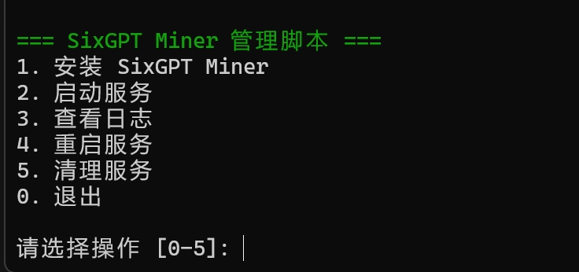

# SixGPT Miner 部署指南

## 支持的系统
- Ubuntu
- Debian
- CentOS

## 前置要求
- 准备 Vana 钱包
  - 确保钱包中有至少 0.1 VANA
  - 在 sixgpt.xyz 上完成钱包登录

## 一键部署
```bash
wget -O Vana-SixGPT.sh https://raw.githubusercontent.com/jadewolf1978/Vana-SixGPT/main/Vana-SixGPT.sh && chmod +x Vana-SixGPT.sh && ./Vana-SixGPT.sh
```

## 功能菜单
运行脚本后，您将看到以下界面：



脚本提供以下功能选项：
```
=== SixGPT Miner 管理脚本 ===
1. 安装 SixGPT Miner
2. 启动服务
3. 查看日志
4. 重启服务
5. 清理服务
0. 退出
```

### 1. 安装 SixGPT Miner
- 自动检测并安装 Docker
- 自动安装 Docker Compose
- 配置运行环境
- 设置钱包私钥

### 2. 启动服务
- 启动所有必要的 Docker 容器
- 自动检查运行状态

### 3. 查看日志
- 实时显示运行日志
- 按 Ctrl+C 退出日志查看

### 4. 重启服务
- 重启所有相关容器
- 保持配置不变

### 5. 清理服务
- 停止所有运行的容器
- 删除相关镜像
- 清理运行环境

## 脚本功能
1. 自动检测并安装 Docker 和 Docker Compose
2. 自动配置运行环境
3. 下载并配置 SixGPT Miner
4. 自动启动服务

## 常用命令
- 查看运行状态：`docker-compose logs -f`
- 停止服务：`docker-compose down`
- 重启服务：`docker-compose restart`
- 完全清理：`docker-compose down --rmi all`

## 注意事项
1. 请确保您有足够的系统权限（sudo）
2. 首次运行时，Docker 会下载必要的镜像，这可能需要一些时间
3. 请妥善保管您的钱包私钥，不要泄露给他人
4. 使用清理功能时请谨慎，该操作会删除所有相关的容器和镜像

## 问题排查
如果遇到问题，请检查：
1. 系统是否支持（Ubuntu/Debian/CentOS）
2. 是否有足够的系统权限
3. 网络连接是否正常
4. 使用"查看日志"功能检查具体错误信息

## 更新记录
- 2024-12-17：
  - 首次发布，支持主流 Linux 发行版
  - 添加交互式菜单系统
  - 增加完整的服务管理功能
  - 优化用户体验
